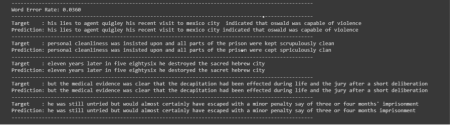

# Anna : Machine Learning

## 📑 Description
This project aims to guide someone to improving their English communication skills. Leveraging advanced technologies like Natural Language Processing (NLP) and Machine Learning (ML), the team plans to create an interactive and effective language learning environment for users. The application will utilize ChatGPT-4 for NLP and incorporate speech recognition for ML, including speech-to-text functionality.

## 📚 Related Project Repositories
|   Learning Paths      |                           Link                            |
| :-------------------: | :-------------------------------------------------------: |
| ☁️ Cloud Computing    | [CC Repository](https://github.com/Anna-Bangkit-2023/CC) |
| 📱 Mobile Development | [MD Repository](https://github.com/Anna-Bangkit-2023/MD) |

## 🤖 Machine Learning: Automatic Speech Recognition (ASR)
Creating Automatic Speech Recognition (ASR) model using Connectionist Temporal Classification (CTC). Leveraging a combination of 2D CNN, RNN, and CTC loss, the model is trained on the LJSpeech dataset. Trained for 50 epochs on the LJSpeech dataset, the model achieves a Word Error Rate (WER) of 0.1655. Leveraging the jiwer package for WER calculation, this ASR system excels in transcribing spoken language into text, making it a robust solution for applications requiring precise speech-to-text conversion.

## 📚 Libraries Used

This project utilizes several Python libraries for data handling, machine learning, and visualization:

| Library                | Purpose                                                   |
| ---------------------- | --------------------------------------------------------- |
| `pandas`               | Facilitates data manipulation and analysis with data frames. |
| `numpy`                | Enables efficient numerical computations and array operations. |
| `tensorflow`           | An open-source machine learning framework for building and training models. |
| `keras`                | High-level neural networks API, integrated with TensorFlow for easy model construction. |
| `matplotlib.pyplot`    | Used for creating visualizations, plots, and charts in Python. |
| `IPython.display`      | Provides tools for interactive computing, useful for dynamic displays. |
| `jiwer`                | Calculates Word Error Rate (WER) for evaluating speech recognition performance. |
